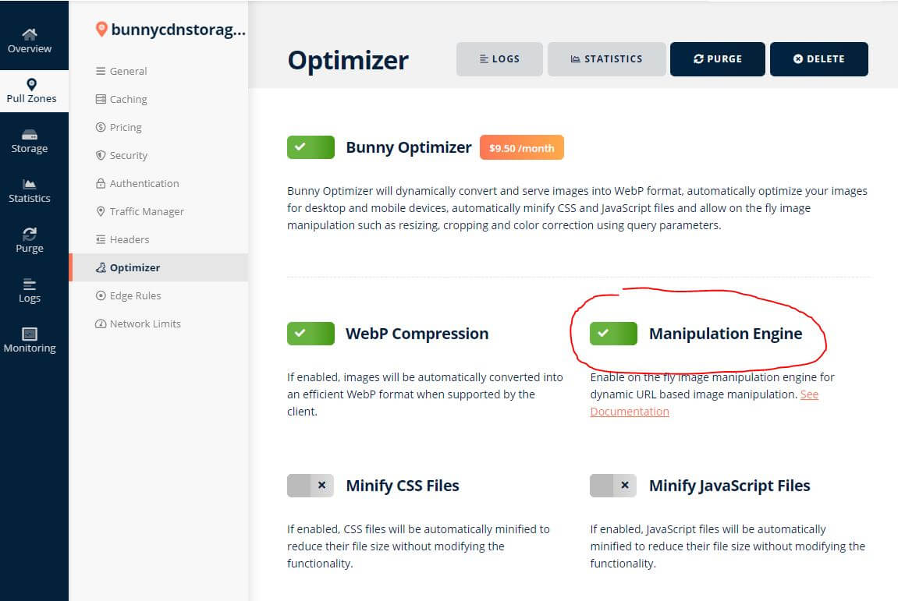

# Thumbnail Processor for Shopware

[](LICENSE.md)

This plugins allows you to use variable thumbnails, if your filesystem (or storage-adapter) supports.
It will add parameters to original image paths.

## Install

Download the plugin from the release page and enable it in shopware.

## Usage

You can activate using of Thumbnail Processor in plugin.
This will access all thumbnails variable from original image. The thumbnail-files won't be needed anymore.

````
f.e.:
https://cdn.example.de/media/image/01/82/69/sasse_200x200.png
 becomes:
https://cdn.example.de/media/image/52/5b/a1/sasse.png?width=200&height=200
````

To remove all thumbnails use following command. This will collect and remove all thumbnails related to the media manager:
`bin/console bunnycdn:thumbnails:remove`

## Tested Supports

### BunnyCDN

So you are able to save traffic and add new thumbnails on the fly.
You would have to active `Bunny Optimizer` and `Manipulation Engine` in your Zone in BunnyCDN.



## License

The MIT License (MIT). Please see [License File](LICENSE) for more information.
